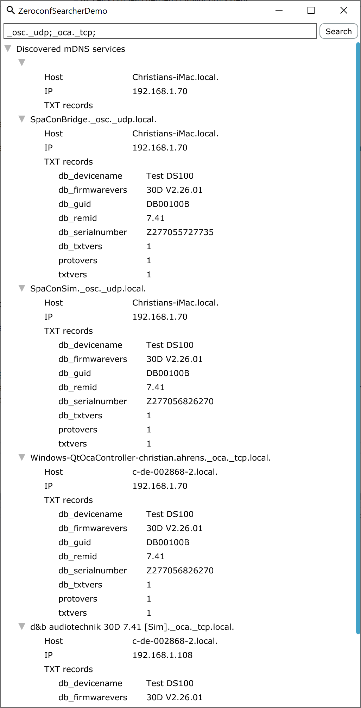

# ZeroconfSearcher

Is a utility class wrapping around MDNS library c API.

See MDNS library project at https://github.com/mjansson/mdns

A minimal UI based on JUCE demos how to use ZeroconfSearcher and looks as follows:

